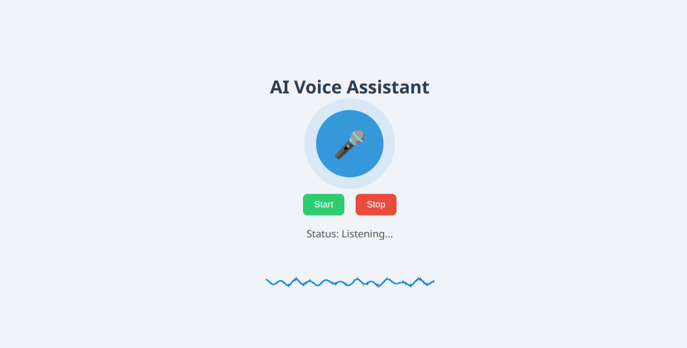

# AI-Voice-Assistent-with-Gemini-API


## 🎙 Gemini Voice Assistant (FastAPI + WebSocket + UI)

This project integrates Google's **Gemini 2.5 Voice Assistant API** into a Python-based **FastAPI** application, offering:

- ✅ Real-time microphone input
- ✅ Streaming voice responses from Gemini
- ✅ Waveform visualization of live audio input (HTML5 + Web Audio API)

---

## 🚀 Features

- 🌐 FastAPI backend for API and WebSocket communication
- 🔊 Microphone input via PyAudio
- 📈 Canvas-based waveform visualization
- 🧠 Gemini 2.5 Flash Native Audio model integration

---

## 🧩 Folder Structure

```
voice_assistant/
├── main.py                  # FastAPI server
├── assistant.py             # Gemini voice assistant logic
├── templates/
│   └── index.html           # Web UI
├── static/
│   ├── js
│   │ └── script.js          # Transcription + waveform script
│   ├── css
│     └── style.css       
├── .env                     # Store your Gemini API key (optional)
└── README.md
```

---

## 🔧 Requirements

- Python 3.8+
- Google Generative AI SDK
- PyAudio (for microphone streaming)
- FastAPI
- Uvicorn
- Jinja2 (for templates)

### 🛠 Install Dependencies

```bash
# Clone the repo
git clone https://github.com/Ahamed-Shojib/AI-Voice-Assistent-with-Gemini-API.git
cd voice-assistent

# Create a virtual environment
python -m venv venv
source venv/bin/activate  # or venv\Scripts\activate on Windows

# Install required packages
pip install -r requirements.txt
```

---

### 📦 `requirements.txt`

```txt
fastapi
uvicorn
pyaudio
google-generativeai
jinja2
```

---

## 🔐 Set Up API Key

Add your Gemini API key in a `.env` file or replace it directly in `assistant.py`.

### Option 1: Use `.env`

Create a `.env` file:

```env
GEMINI_API_KEY=your-api-key-here
```

Then in `assistant.py`, update:

```python
import os
from dotenv import load_dotenv
load_dotenv()

api_key = os.getenv("GEMINI_API_KEY")
client = genai.Client(api_key=api_key, http_options={"api_version": "v1beta"})
```
or
```python
api_key = "Your GEMINI_API_KEY" #Place Your API key in assistent.py file
```

---

## ▶️ Run the App

```bash
uvicorn main:app --reload
```

Then open your browser:

```
http://127.0.0.1:8000
```

---

## 🌐 Web UI

* 🎙 Click "Start" to activate the voice assistant.
* 🛑 Click "Stop" to shut down the session.
* 📊 A waveform of your voice will animate as you speak.

---

## 📸 Screenshots



---

## 🧠 Powered by

* [Google Gemini Generative AI](https://ai.google.dev/)
* [FastAPI](https://fastapi.tiangolo.com/)
* [PyAudio](https://people.csail.mit.edu/hubert/pyaudio/)
* [Web Audio API](https://developer.mozilla.org/en-US/docs/Web/API/Web_Audio_API)

---

## 🛡 License

MIT License

---

## 💬 Contribution

Pull requests are welcome! If you have ideas for adding:

* Voice-to-command execution
* Voice form filling
* Multilingual support

Feel free to contribute!

---

## 🙋‍♂️ Author

**Mehedi Hasan**  
📧 [Email](mailto:mehedi.cse.gub.25@gmail.com)  
🌐 [LinkedIn](https://www.linkedin.com/in/mehedi-hasan-shojib/)  

